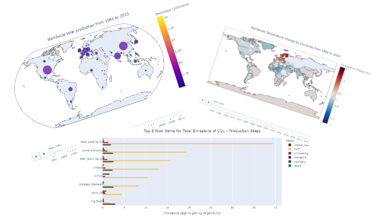

# Data Manipulation and Visualization - Food project   

  

## Data used and context

This is the second project of the Data Science course of [start2impact](https://www.start2impact.it/percorsi/#data-science).

The use of two datases was suggested, to which I decided to support even a third. All three datases are available on Kaggle:

- The [first](https://www.kaggle.com/datasets/dorbicycle/world-foodfeed-production), available on **[FAOSTAT](https://www.fao.org/faostat/en/#data)** portal of the FAO (Food and Agriculture Organization of the United Nations) website, contains data on the production of food and feed worldwide, from 1961 to 2013.

- The [second](https://www.kaggle.com/datasets/selfvivek/environment-impact-of-food-production), provided by **[Our World in Data](https://ourworldindata.org/environmental-impacts-of-food)**, mainly shows the quantities of greenhouse gases that are emitted in the various steps of the production chain of 43 of the most produced foods in the world. 

- The [third](https://www.kaggle.com/datasets/sevgisarac/temperature-change/code?datasetId=1056827&sortBy=voteCount), also provided by **FAOSTAT**, contains data on the average variation in surface temperature by country, with annual updates for the period 1961-2019. The values recorded in this dataset are understood as anomalies, that is variations in temperature with respect to a basic climatology, corresponding to the period 1951-1980. 

## Project objective and requirements

> **Objective**:  
Based on data on the worldwide production and distribution of food and feed, analyze the impact that these have on the environment.   

The work must be delivered bearing in mind that the Jupyter notebook must be **similar to a presentation** to be shown to a hypothetical customer: avoid projects that are too verbose and repetitive in the analysis. Choosing *which concept to show and why, avoiding unnecessary information* is one of the skills to develop for this project.

The project must be divided in 6 parts: 

> - **Discovery (problem identification and objectives)**
> - **Data selection**
> - **Data cleaning**
> - **Data exploration**
> - **Data transformation**
> - **Data visualization**

## Libraries used

-  **numpy**
-  **pandas**
-  **plotly (express)**
-  **fuzzywuzzy**

## Notes

To corretly display the graphs I recommend opening the project on [kaggle](https://www.kaggle.com/code/emanueleimmesi/food-project-data-manipulation-and-visualization), or on [nbviewer](https://nbviewer.org/github/TheHextech/start2impact/blob/master/Data_Science/Food_Project_DataVisualization_DataManipulation/EmanueleImmesiDataVis.ipynb#4.-Data-Exploration-&-Data-Visualization).

Corrected on 2022-06-21. Exceeded with 500/500.
