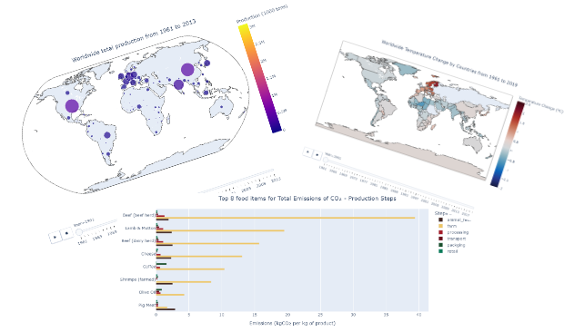

# Data Manipulation and Visualization - Food project   

  

## Dati utlizzati e contesto

Questo è il secondo progetto del corso di Data Science di [start2impact](https://www.start2impact.it/percorsi/#data-science).

Per questo compito è stato suggerito l'utilizzo di due datasets, ai quali ho deciso di affiancarne anche un terzo. Tutti e tre i datasets sono disponibili su Kaggle:

- Il [primo](https://www.kaggle.com/datasets/dorbicycle/world-foodfeed-production), consultabile sul portale **[FAOSTAT](https://www.fao.org/faostat/en/#data)** della FAO (Food and Agriculture Organization of the United Nations), contiene i dati di produzione di molteplici cibi ('food') e mangimi ('feed') a livello mondiale, dal 1961 al 2013.

- Il [secondo](https://www.kaggle.com/datasets/selfvivek/environment-impact-of-food-production), fornito da **[Our World in Data](https://ourworldindata.org/environmental-impacts-of-food)**, mostra principalmente i quantitativi di gas serra che sono emessi nei vari step della catena produttiva di 43 degli alimenti più prodotti nel mondo.

- Il [terzo](https://www.kaggle.com/datasets/sevgisarac/temperature-change/code?datasetId=1056827&sortBy=voteCount), fornito anch'esso da **FAOSTAT**, contiene dati sulla variazione media della temperatura superficiale per paese, con aggiornamenti annuali del periodo 1961–2019. I valori registrati in questo dataset sono intesi come anomalie, cioè variazioni di temperatura rispetto a una climatologia di base, corrispondente al periodo 1951-1980.

## Obiettivo e requisiti del progetto

> **Obiettivo**:  
A partire dai dati inerenti alla produzione e distribuzione mondiale di alimenti e mangimi si analizzi l'impatto che questi hanno sull'ambiente.  

Il lavoro va consegnato tenendo a mente che il notebook di Jupyter deve essere **simile ad una presentazione** da mostrare ad un ipotetico cliente: evitare progetti che siano troppo prolissi e ripetitivi nelle analisi. Scegliere *cosa mostrare e perché* mostrare quel concetto rispetto ad un altro è una delle capacità da sviluppare per questo progetto.

Il progetto deve di essere diviso in 6 fasi: 

> - **Discovery (identificazione del problema e degli obiettivi)**
> - **Data selection**
> - **Data cleaning**
> - **Data exploration**
> - **Data transformation**
> - **Data visualization**

## Librerie utilizzate

-  **numpy**
-  **pandas**
-  **plotly (express)**
-  **fuzzywuzzy**

## Note

Per visualizzare correttamente i grafici consiglio di aprire il progetto su [nbviewer](https://nbviewer.org/github/TheHextech/start2impact/blob/master/Data_Science/Food_Project_DataVisualization_DataManipulation/EmanueleImmesiDataVis.ipynb#4.-Data-Exploration-&-Data-Visualization).
